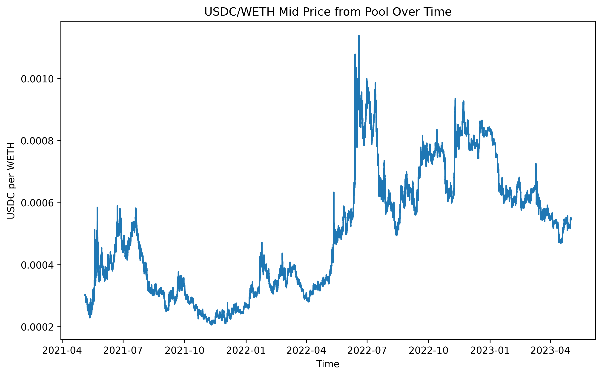
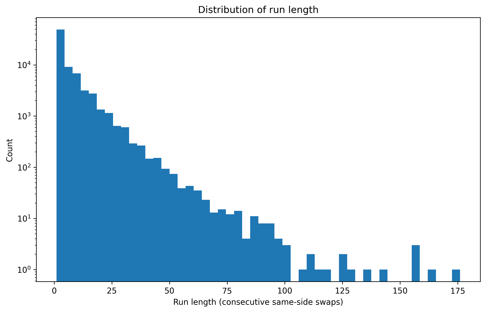
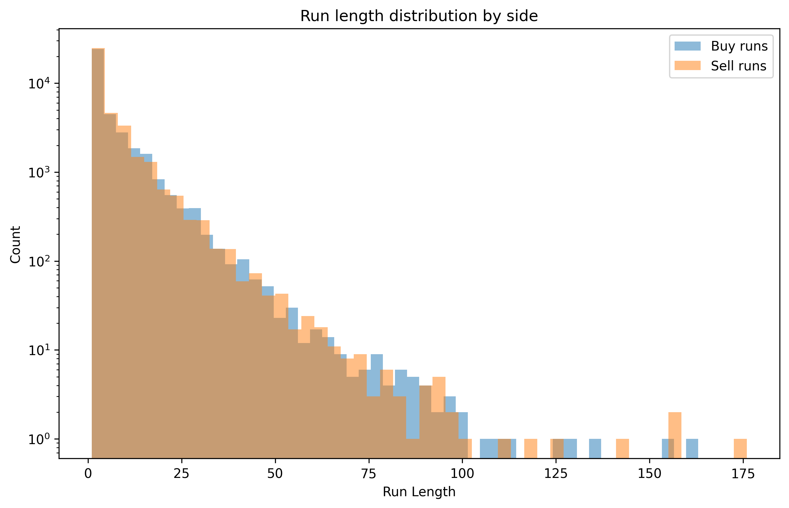

# Measuring and Forecasting Adverse Selection Loss in DEXs
**Currently ongoing research**

## Intent
The intent of this research project is to determine a realistic and 
effective metric for measuring the transaction costs of being a maker on a decentralized exchange.
This also will involve determining correlations and forecasting transaction costs,
in order to gage a fundamental value band. A realistic metric would take the
form of one which accounts for the various frictions that exist in trading
itself, on top of those that are unique to trading in a decentralized
capacity, where the liquidity provision involves LPs depositing
into pools and trading prices are determined through an algorithmic
function.

This project will also attempt to forecast LP loss to informed trading,
which may be useful when implementing a temporal function market maker (TFMM),
adjusting prices to avoid LP loss. 

I will also explore how adverse selection and adverse selection forecasting
are related statistically to the various metrics for measuring liquidity.

## Past Methods and Literature

### Measuring LP loss to Adverse Selection and other trading strategies
Previous methods for measuring LP adverse selection loss have included impermanent loss (IL), loss vs. rebalancing (LVR),
and, more recently, rebalancing vs. rebalancing (RVR. Each of these, arguably,
has their place in measuring trader loss to adverse selection,
and in some instances, are limited to measuring loss due to shipping arbitrage.
Below are definitions of existing metrics.

1. **Impermanent Loss**: The shortfall between the value accrued from
providing your tokens as liquidity in an AMM pool vs. the value you'de
have if you had just performed the HODL strategy.
2. **Loss vs. Rebalancing**: The accrued shortfall between the value of the
LP's position in the AMM vs. the value of an ideal *frictionless* portfolio
that is continuously rebalancing at true market prices.
    - Citation: [Automated Market Making and Loss-Versus-Rebalancing](https://arxiv.org/abs/2208.06046)
3. **Rebalancing vs. Rebalancing**: The shortfall between LP performance
vs. a practical CEX-style rebalancing strategy which accounts for 
trading costs and other market frictions.
    - Citation: [Rebalancing-versus-Rebalancing: Improving the fidelity of Loss-versus-Rebalancing](https://arxiv.org/abs/2410.23404)

### Metrics for measuring pool liquidity

1. **Effective Spread**: The difference in quoted price between buying
and selling a fixed amount of a given token in a liquidity pool,
minus transaction fees.
2. **Total Value Locked**: The US dollar value of a pool's token reserves.
    - Computed by keeping track of total transactions (mints, burns, etc)
    for a pool, and multiplying total pool makeup by pool asset price.
3. **Counterfactual v2 Spread**: Used as a benchmark for comparison
with a real pool's spread to determine whether a pool is effectively
allocating its liquidity.
    - Citation: [What Drives Liquidity on Decentralized Exchanges?](https://arxiv.org/html/2410.19107v2)

## Notes on DEX Volatility
One important consideration to make is the extent to which DEX volatility
is made up of transitory versus fundamental volatility. Various research
papers I have read seem to agree that less informed trading takes place
on a DEX due to various factors that are a result of its design. The majority of the informed
trading that does take place seems to come from CEX and DEX shipping arb
which occurs as a result of transitory volatility driven pricing.

## Data Requirements

### To Compute LVR we need:
1. All pool updates (swaps, mints, burns) which we can use to 
reconstruct pool reserves
       - for uniswap v3, swap events also give amount0, amount1
       sqrtPriceX96, liquidity, tick
2. CEX price for risky asset
3. fee tier of the pool 

LVR = (P_ref,j - P_AMM,j) * change_Q_j


## Setting Up AWS Blockchain RPC (Not neccesary but useful for other work)

1. Set your proper AWS credentials using:
```
aws configure
```
2. Create the Ethereum Node (AMB Access), this returns a NodeId:
```
aws managedblockchain create-node \
  --network-id n-ethereum-mainnet \
  --node-configuration '{
    "InstanceType": "bc.t3.xlarge",
    "AvailabilityZone": <zone>
  }'
```
3. Get the details of the NodeId, this returns an HttpEndpoint and WebSocketEndpoint:
```
aws managedblockchain get-node \
  --network-id n-ethereum-mainnet \
  --node-id <node-id> \
  --query "Node.FrameworkAttributes.Ethereum"
```
4. Create an Accessor (billing token):
```
aws managedblockchain create-accessor \
  --accessor-type BILLING_TOKEN
```
5. Build the RPC URL using node-id and billing token and place this into your .env:
**https://\<node-id-lowercase>.t.ethereum.managedblockchain.us-east-1.amazonaws.com?billingtoken=\<BILLING_TOKEN>**


## Spinning up a Spark cluster on EMR with JupyterHub (Steps so I can remember later lol)

1. Create EMR cluster (choose Spark and JupyterHub), just used m5.xlarge instances (master and configure)
2. Find EMR primary node public DNS and on its master security group add new inbound rule:
  - TCP 9443, my IP
3. Search **https://\<primary-dns>:9443/** in browser

## So Far:

### USDC/WETH midprice timeseries
 - This will be useful for later computations of taker adverse selection



### USDC/WETH trade run length distribution






