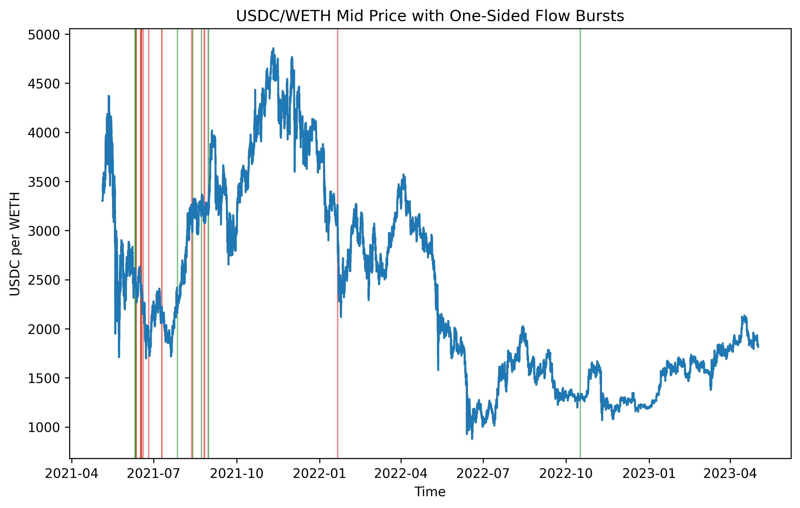

# AMM Market Microstucture Lab
**Currently ongoing research**

## Intent
The purpose of this repo is to centralize my ongoing work in researching
decentralized market microstructure, and how these markets compare to the dynamics
so well documented in tradfi. 

More specifically, this repo will include studies of various methods for
measuring adverse selection, both on the maker and taker sides. On top of
that, it will also include various ways for measuring Dex liquidity, and
ways for determining whether a pool is efficiently distributing its liquidity across
the pricing function.

Essentially, whatever I am learning and curious about will be attempted in
this repo :).

### Measuring LP loss to Adverse Selection and other trading strategies
Previous methods for measuring LP adverse selection loss have included impermanent loss (IL), loss vs. rebalancing (LVR),
and, more recently, rebalancing vs. rebalancing (RVR. Each of these, arguably,
has their place in measuring trader loss to adverse selection,
and in some instances, are limited to measuring loss due to shipping arbitrage.
Below are definitions of existing metrics.

1. **Impermanent Loss**: The shortfall between the value accrued from
providing your tokens as liquidity in an AMM pool vs. the value you'de
have if you had just performed the HODL strategy.
2. **Loss vs. Rebalancing**: The accrued shortfall between the value of the
LP's position in the AMM vs. the value of an ideal *frictionless* portfolio
that is continuously rebalancing at true market prices.
    - Citation: [Automated Market Making and Loss-Versus-Rebalancing](https://arxiv.org/abs/2208.06046)
3. **Rebalancing vs. Rebalancing**: The shortfall between LP performance
vs. a practical CEX-style rebalancing strategy which accounts for 
trading costs and other market frictions.
    - Citation: [Rebalancing-versus-Rebalancing: Improving the fidelity of Loss-versus-Rebalancing](https://arxiv.org/abs/2410.23404)

### Metrics for measuring pool liquidity

1. **Effective Spread**: The difference in quoted price between buying
and selling a fixed amount of a given token in a liquidity pool,
minus transaction fees.
2. **Total Value Locked**: The US dollar value of a pool's token reserves.
    - Computed by keeping track of total transactions (mints, burns, etc)
    for a pool, and multiplying total pool makeup by pool asset price.
3. **Counterfactual v2 Spread**: Used as a benchmark for comparison
with a real pool's spread to determine whether a pool is effectively
allocating its liquidity.
    - Citation: [What Drives Liquidity on Decentralized Exchanges?](https://arxiv.org/html/2410.19107v2)

## Notes on DEX Volatility
One important consideration to make is the extent to which DEX volatility
is made up of transitory versus fundamental volatility. Various research
papers I have read seem to agree that less informed trading takes place
on a DEX due to various factors that are a result of its design. The majority of the informed
trading that does take place seems to come from CEX and DEX shipping arb
which occurs as a result of transitory volatility driven pricing.


## Setting Up AWS Blockchain RPC (Not neccesary but useful for other work)

1. Set your proper AWS credentials using:
```
aws configure
```
2. Create the Ethereum Node (AMB Access), this returns a NodeId:
```
aws managedblockchain create-node \
  --network-id n-ethereum-mainnet \
  --node-configuration '{
    "InstanceType": "bc.t3.xlarge",
    "AvailabilityZone": <zone>
  }'
```
3. Get the details of the NodeId, this returns an HttpEndpoint and WebSocketEndpoint:
```
aws managedblockchain get-node \
  --network-id n-ethereum-mainnet \
  --node-id <node-id> \
  --query "Node.FrameworkAttributes.Ethereum"
```
4. Create an Accessor (billing token):
```
aws managedblockchain create-accessor \
  --accessor-type BILLING_TOKEN
```
5. Build the RPC URL using node-id and billing token and place this into your .env:
**https://\<node-id-lowercase>.t.ethereum.managedblockchain.us-east-1.amazonaws.com?billingtoken=\<BILLING_TOKEN>**


## Spinning up a Spark cluster on EMR with JupyterHub (Steps so I can remember later lol)

1. Create EMR cluster (choose Spark and JupyterHub), just used m5.xlarge instances (master and configure)
2. Find EMR primary node public DNS and on its master security group add new inbound rule:
  - TCP 9443, my IP
3. Search **https://\<primary-dns>:9443/** in browser


## Steps for forecasting LVR using 

### Base Features
- block_timestamp
- block_number
- tx_hash
- sqrtPriceX96
- tick
- liquidity
- amount0, amount1
- sender, recipient
- event_type 
- external_fair_price (CEX Mid) **idk where I am getting this for free**

### Derived Features 

#### 1. Pool mid price

From Uniswap v3 sqrt price:

$$
P_{\text{pool},t}
= \left(\frac{\text{sqrtPriceX96}_t}{2^{96}}\right)^2
\cdot \frac{\text{token1 units}}{\text{token0 units}}
$$

(Adjusted so that \(P_{\text{pool},t}\) is quoted in the same units as \(P_{\text{ref},t}\).)

#### 2. Intraday log returns (from reference price)

For sampling interval \(\Delta\):

$$
r_t = \ln P_{\text{ref},t} - \ln P_{\text{ref},t-\Delta}
= \ln\!\left(\frac{P_{\text{ref},t}}{P_{\text{ref},t-\Delta}}\right)
$$

#### 3. Daily realized variance

For each day \(d\), using all intraday returns on that day:

$$
RV_d = \sum_{t \in d} r_t^2
$$

This is the realized variance of the external fair price, used as a volatility regressor.

---

### 4. Daily realized LVR (Target)

We proxy **realized LVR** as the total arbitrage profit (LP loss) per unit liquidity.

1. **Flag arbitrage swaps**: swaps that move the pool price toward the reference price:

$$
|P_{\text{pool,post},i} - P_{\text{ref},i}|
<
|P_{\text{pool,pre},i} - P_{\text{ref},i}|
$$

2. **Per-swap LP loss / arb profit**:

Let \(\Delta Q_i\) be the traded quantity of the base asset, and
\(P_{\text{pool},i}^{avg}\) the swap’s average execution price (from `amount_in/amount_out` or mid of pre/post):

$$
\text{LVR}_i \approx (P_{\text{ref},i} - P_{\text{pool},i}^{avg}) \cdot \Delta Q_i
$$

(sign chosen so positive = loss to LPs / profit to arb).

3. **Aggregate by day**:

Nominal LVR:

$$
LVR^{\text{nominal}}_d = \sum_{i \in d} \text{LVR}_i
$$

Normalize by average daily liquidity \(liq_d\):

$$
LVR^{\text{per-unit}}_d = \frac{LVR^{\text{nominal}}_d}{liq_d}
$$

We model and forecast \(LVR^{\text{per-unit}}_d\) using realized variance and the microstructure features above.


### What is HAR-VAR and why did we choose it?

Expected LVR in AMMs is essentially an increasing function of future quadratic variation. This means that 
forecasting LVR largely reduces to forecasting realized variance in a way that also respects its time-scale
structure. The HAR-RV model fits here because it decomposes realized volatility into daily, weekly, and monthly
components, which is able to capture the long-memory behavior that drives LP risk.


## Other work done so far:

### USDC/WETH midprice timeseries
 - This will be useful for later computations of taker adverse selection


### USDC/WETH trade run length distribution


### USDC/WETH midprice timeseries with order flow bursts (>100 consecutive)



## Goals:

  - **Forecasting Loss-Versus-Rebalancing**: 
  - **Analyze liquidity distributions**: (liquidity surface) and how that changes over time
  in response to price moves and trades. Also determine if liquidity ranges are indicative
  of price movements (informed liquidity provision).
      - tools: PCA, vector autoregression
  - **Graph Based Transaction Network**:
  - **Price Prediction using Transformer**:
  

## Notes:
  
### MEV Solutions
  - MEV tax allows apps to capture priority fee for their own benefit 

## Sources

[Automated Market Making and Loss-Versus-Rebalancing](https://arxiv.org/abs/2208.06046)
[Rebalancing-versus-Rebalancing: Improving the fidelity of Loss-versus-Rebalancing](https://arxiv.org/abs/2410.23404)
[What Drives Liquidity on Decentralized Exchanges?](https://arxiv.org/html/2410.19107v2)
[Priority is all you need](https://www.paradigm.xyz/2024/06/priority-is-all-you-need)

