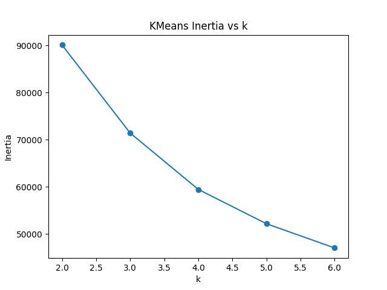
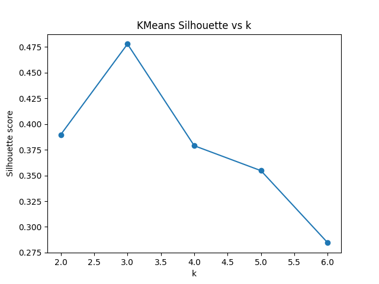
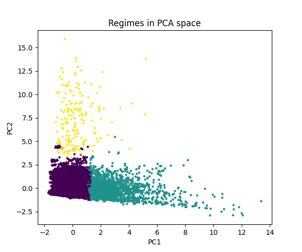
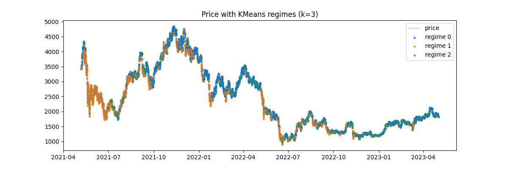
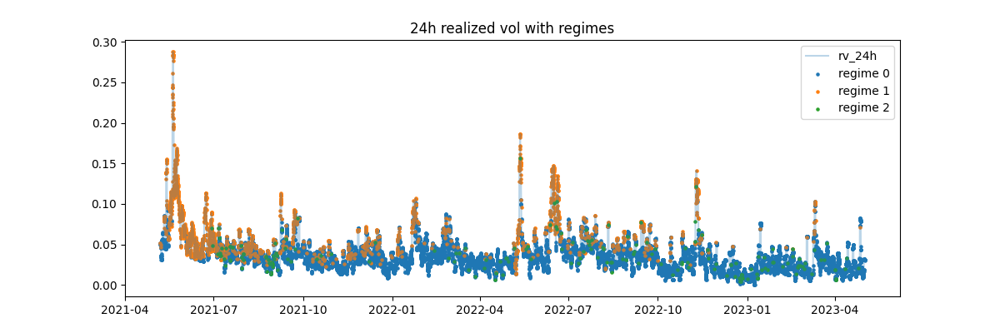

# Uniswap Regimes Volatility Analysis

## Intro

This note applies unsupervised learning (KMeans clustering) to a Uniswap v3 USDC-WETH liquidity pool
microstructure data- realized volatility, liquidity, LP flow features-to identify market regimes. This work was conducted
as a part of a broader project and work towards forecasting the Loss-Versus-Rebalancing (LVR) that
informed arbitrageurs can extract from automated market makers at the expense of liquidity providers (LPs).
In particular, LVR measures the performance gap between a passive LP position and a hypothetical
portfolio that continuously rebalances at external market prices.

The central idea is that if we can characterize distinct "risk regimes" within a Uniswap v3 pool from
microstructure data alone, then LVR forecasts might be refined on a per-regime basis, using different
volatility or LVR models in calm periods vs high-volatility breakout periods.

## Background

Unsiwap is a family of decentralized exchanges (DEXs) built on automated market
makers (AMMs) rather than more computationally expensive order books. Prices are
determined by a constant-function invariant that maps the pool's token reserves
to a swap price. Uniswap v3 introduces **concentrated liquidity**, which allows
users to select custom price ranges (ticks) over which their liquidity is active.
This design greatly improves capital efficiency but also makes LP risk much more
complex, since only in-range liquidity earns fees and is exposed to price moves.

Alongside familiar issues in TradFi like frontrunning and sandwhich attacks, concentrated
liquidity AMMs expose LPs to newer formns of adverse-selection risk known as 
**Loss-Versus-Rebalancing (LVR)**. LVR is the difference between (i) the value
of a passive LP position in the pool and (ii) the value of a "rebalancing" portfolio
that trades at external market prices to maintain the same notional exposure.
It can be interpreted as an upper bound on the value that CEX-DEX arbitrageurs can
extract from the pool, and a lower bound on the hidden cost borne by LPs due to 
information assymetry and latency.

Because LVR is tightly linked to price volatility and the amount and shape of
liquidity in the pool, it is natural to ask whether we can identify recurring
**liquidity/volatility regimes** directly from pool-level data, and whether these
regimes carry any additional information about future realized volatility beyond 
standard volatility clustering. This is the question this note investigates.

## Data and Preprocessing

### Pool and Sampling Window

The analysis focuses on the Uniswap v3 USDC-WETH pool on Ethereum. I extract 
on-chain events (swaps, mints, and burns) over a contiguous historical window and
construct an hourly time series. Each observation corresponds to one hour of pool
activity and summarizes the microstructure state of the AMM during that window.

All timestamps are converted from block time to UTC datetime and then resampled
on a fixed 1-hour grid. Hours with no on-chain activity are retained in the panel
to avoid survivorship bias and to keep downstream rolling-window calculations
well-defined.

### From Raw Events to an Hourly Panel

For each raw event type:

- **Swaps**
  - Parse `amount0`, `amount1`, and `sqrtPriceX96` along with the block timestamp.
  - Convert token amounts from raw integer units to human-readable units using
  token decimals (USDC: 6, WETH: 18).
  - Derive a mid-price for the pool from `sqrtPriceX96` and token decimals. In this
  note I treat USDC as the numeraire, and work primarily with the price "USDC per 1 WETH."

- **Mints and Burns**
  - Parse each liquidity provision (`Mint`) and withdrawal (`Burn`) event.
  - Record the amounts of each token contributed or withdrawn, along with the
  event timestamp.
  - These events later feed into hourly LP flow counts and net amounts.

After parsing, I set the timestamp as the index and resample to 1-hour frequency:

- For **swap-based quantities** (price, volume):
  - Within each hour, compute OHLC price (open, high, low, close) from the sequence
  of trade price.
  - Compute total hourly USD volume and the number of swaps.
  - Compute the average trade size in USD as volume divided by swap count.

- For **liquidity and LP events**:
  - Take the last observed on-chain liquidity level in each hour as `liquidity_last`,
  and also compute the intra-hour mean and rolling 24-hour volatility of liquidity changes.
  - Count mints and burns per hour and sum their token amounts to obtain the net
  LP flow measures.

  ### Handling Missing Activity

  Resampling  introduces hours with no swaps or LP events. I handle these gaps as follows:

  - For **state variables** that are naturally persistent-such as price and liquidity
  I forward-fill the last observed value so that the state remains defined even if 
  nothing trades in a given hour.
  - For **flow variables** such as volume, swap counts, or LP mints/burns, I set the
  hourly values to zero when there are no events. 
  - After these steps, I drop only those rows that are missing values required
  for rolling-window calculations (first few hours when computing reallized vol).

  The result is a contiguous hourly panel where each row corresponds to a well-defined
  microstructure state of the USDC-WETH pool, and where both "quiet" hours and "active"
  hours are represented.

## Feature Engineering

Given the hourly panel, I construct a set of microstructure features which are intended to summarize the "current state" of the USDC-WETH pool in each hour. These features are under three main categories:

- Volatility and trend  
- Trading activity  
- Liquidity and LP behavior  

### Price, Returns, and Realized Vol

Let $P_t$ denote the hourly close price of WETH in units of USDC (USDC per 1 WETH), derived from the Uniswap v3 `sqrtPriceX96` field and token decimals. I work with log prices and log returns.

Log price:

$$
\ell_t = \log P_t
$$

1-hour log return:

$$
r_t = \ell_t - \ell_{t-1}
$$

From these returns I construct simple realized volatility measures over rolling windows.

4-hour realized volatility:

$$
\mathrm{RV}^{(4h)}_t = \sqrt{\sum_{k=0}^{3} r_{t-k}^2}
$$

24-hour realized volatility:

$$
\mathrm{RV}^{(24h)}_t = \sqrt{\sum_{k=0}^{23} r_{t-k}^2}
$$

These are equivalent to standard realized volatility measures used in high-frequency finance, but computed from hourly returns on the AMM mid-price.

### Trend: Moving Averages and MA Ratio

To capture slow versus fast prixe movement I compute the simple moving averages of the hourly close.

4-hour moving average:

$$
\mathrm{MA}^{(4h)}_t = \frac{1}{4} \sum_{k=0}^{3} P_{t-k}
$$

24-hour moving average:

$$
\mathrm{MA}^{(24h)}_t = \frac{1}{24} \sum_{k=0}^{23} P_{t-k}
$$

I then define a moving-average ratio as a scale-free trend indicator:

$$
\mathrm{MA\_ratio}_t = \frac{\mathrm{MA}^{(4h)}_t}{\mathrm{MA}^{(24h)}_t}.
$$

The values near one show short and long-horizon averages agree, while deviations above or below 1 show short-term moves away from the longer-run level.

### Trading Activity: Volume and Swap Counts

For each hour, I summarize swap activity into volume and counts.

Hourly USD volume $\mathrm{Vol}^{(1h)}_t$: sum of absolute traded notional, computed by converting both legs of each swap into USDC using the prevailing pool price and summing over all swaps in the hour.

Swap count: the number of swaps in the hour.

Average trade size in USD:

$$
\mathrm{AvgTradeSize}_t =
\begin{cases}
\dfrac{\mathrm{Vol}^{(1h)}_t}{\mathrm{SwapCount}_t}, & \text{if } \mathrm{SwapCount}_t > 0, \\
0, & \text{otherwise.}
\end{cases}
$$

These features capture how “busy” the pool is and the typical size of trades in each microstructure state.

### Liquidity Level and Liquidity Volatility

On Uniswap v3, the on-chain liquidity field reflects the amount of active liquidity in the current price range. For each hour I compute:

Liquidity level: last observed on-chain liquidity in the hour, denoted $\mathrm{Liq}_t$.

Absolute liquidity change:

$$
\Delta \mathrm{Liq}_t = \mathrm{Liq}_t - \mathrm{Liq}_{t-1}.
$$

Relative liquidity change (when $\mathrm{Liq}_{t-1} > 0$):

$$
\Delta \mathrm{Liq}^{(\mathrm{rel})}_t = \frac{\mathrm{Liq}_t - \mathrm{Liq}_{t-1}}{\mathrm{Liq}_{t-1}}.
$$

24-hour liquidity volatility: a rolling standard deviation of relative changes:

$$
\mathrm{LiqVol}^{(24h)}_t =
\mathrm{StdDev}\left( \Delta \mathrm{Liq}^{(\mathrm{rel})}_{t-k} \right)_{k=0}^{23}.
$$

Intuitively, $\mathrm{Liq}_t$ measures how deep the pool is at time $t$, while $\mathrm{LiqVol}^{(24h)}_t$ measures how much that depth has been changing over the past day.

### LP Activity: Mint/Burn Events and Net Flows

From the mint and burn events I construct LP flow features.

Mint and burn counts:

- $\mathrm{MintCount}_t$: number of Mint events in hour $t$.  
- $\mathrm{BurnCount}_t$: number of Burn events in hour $t$.

Token amounts (hourly sums):

- $\mathrm{MintAmt0}_t$, $\mathrm{MintAmt1}_t$: total token0/token1 supplied by LPs.  
- $\mathrm{BurnAmt0}_t$, $\mathrm{BurnAmt1}_t$: total token0/token1 withdrawn.

Net LP flow per token:

$$
\mathrm{NetAmt0}_t = \mathrm{MintAmt0}_t - \mathrm{BurnAmt0}_t, \quad
\mathrm{NetAmt1}_t = \mathrm{MintAmt1}_t - \mathrm{BurnAmt1}_t.
$$

Total LP event count:

$$
\mathrm{LPEventCount}_t = \mathrm{MintCount}_t + \mathrm{BurnCount}_t.
$$

In some plots and experiments I also scale net token flows into approximate USD terms using the pool price, to interpret them as net capital entering or leaving the pool.

### Microstructure State Vector Used for Clustering

In the clustering step, I focus on a subset of these features that jointly describe volatility, trading intensity, depth, and LP activity. The microstructure state vector for each hour $t$ is:

$$
x_t = \big(
\mathrm{RV}^{(24h)}_t,\ 
\mathrm{MA\_ratio}_t,\ 
\mathrm{Vol}^{(1h)}_t,\ 
\mathrm{Liq}_t,\ 
\mathrm{LiqVol}^{(24h)}_t,\ 
\mathrm{LPEventCount}_t
\big).
$$

Before applying KMeans, I standardize each component of $x_t$ to zero mean and unit variance. This prevents features with large numerical scales (such as liquidity or volume) from dominating the clustering purely due to their units, and encourages the algorithm to group hours based on genuine structure rather than raw magnitudes.

## Clustering Methodology

The goal of the clustering step is to group hours with similar microstructure states
in a small number of regimes. I use KMeans on the standardized feature vectors defined above.

### KMeans Specification

I use the standard KMeans algorithm as implemented in scikit-learn. The model minimizes
the within-cluster sum of squared distances ("inertia") between each point and
the assigned centroid.

Key Settings:

- **Distance metric:** Euclidean distance in the standardized feature space.
- **Initialization:** multiple random centroid initializations to reduce
sensitivity to starting points.
- **Max iterations:** a fixed cap with early stopping.
- **Random seed:** fixed `random_state` for reproducability.

### Choosing the Number of Clusters

To select the number of regimes, I estimate KMeans solutions for \(k \in \{2,3,4,5,6\}\)
and evaluate each using two diagnostics:

- **Inertia (within-cluster SSE):** decreases as \(k\) increases. I look at the
"elbow" in the inertia-versus-\(k\) curve to see where additional clusters result in
diminishing returns in fit. 
- **Silhouette score:** measures how well-separated clusters are, taking values in
\([-1,1]\) where higher is better. For each \(k\), I compute the mean silhouette 
score across all points.

In my result, \(k=3\) gives a reasonable trade-off because it lies near the elbow in
the inertia curve and also has the highest average silhouette score among the values
that were tested. This suggests that three regimes are the most compact and separated.

### Stability Across Random Initializations

KMeans can be sensitive to initialization. To ensure that the three-regime solution
is not a result of a particular random seed, I refit the model multiple times using
different seeds and compare the resulting labelings using the **adjusted Rand index (ARI)**.

- I run KMeans \(N\) times on the same standardized data.
- For each run I compute the ARI between their cluster labels.
- I then am able to summarize distribution of ARIs across all pairs (mean and std).

In my experiments, the mean ARI between runs is high, which shows that \(k=3\) solution
is reasonably stable to different initializations and that the discovered regimes are
not pure noise from optimization.

## Regime Characterization and Interpretation

After fitting KMeans with \(k = 3\) on the standardized state vectors, I interpret
each cluster as a distinct liquidity/volatility regime for the USDC-WETH pool.

To make the regimes easier to reason about, I map the raw labels to descriptive names.

- **normal_calm** (regime 0) - baseline conditions
- **high_vol_breakout** (regime 1) - high realized volatility and heavy trading
- **deep_liquidity_reconfig** (regime 2) - rare episodes with unusually large liquidity and
LP activity

### Descriptive Statistics by Regime

To summarize the regimes, I compute the mean of each microstructure feature
for each cluster.

Very roughly:

- **normal_calm**
  - Lowest 24h realized vol
  - Moderate hourly volume and swap counts
  - "Normal" liquidity levels and relatively low liquidity vol
  - Low to moderate LP event count

- **high_vol_breakout**
  - 24h realized vol is more than twice that of normal_calm
  - hourly USD volume is several times higher than normal_calm
  - Liquidity levels are similar or slightly higher than normal_calm, but pool
  is being traded through much more intensely.
  - LP event counts are also higher

- **deep_liquidity_reconfig**
  - Realized vol is not as extreme as high_vol_breakout, but on-chain liquidity
  levels are an order of magnitude larger
  - Liquidity vol is elevated
  - LP event count are relatively high even with regime being rare
  - Interpretation: episodes where large LPs move in or out, or tick distribution
  is being largely reconfigured.

### Separation in PCA Space

To visualize how distinct the regimes are in the feature space, I project the 
standardized vectors onto the first two principal components and color points by regime
labels. We can see:

- **normal_calm** hours concentrated in a tight, low-variance cloud.
- **high_vol_breakout** hours fanning out along directions associated with higher vol
- **deep_liquidity_reconfig** hours occupying a smaller, more extreme region
associated with very high liquidity and liquidity vol.

Note that the clusters  are not perfectly linearly separable, but the PCA plot
suggests that the regimes capture meaningful structure and not pure noise.

### Time-Series View: When do regimes occur?

Next, I overlay the regime labels on the original price series and on 24h realized vol:

- On the **price chart**, high_vol_breakout points tend to cluster around large
directional moves and local tops/bottoms. normal_calm dominates long stretches of 
relatively stable price movements. deep_liquidity_reconfig appears in short bursts,
typically around periods of drastic changes in on-chain liquidity.

- On the **24h realized vol chart**, high_vol_breakout lines up with the tallest
vol spikes, while normal_calm fills in the low-vol background. deep_liquidity_reconfig
typically occurs in transitions in vol instead of at the very peak.

These plots help show that KMeans regimes correspond to recognizable phases in
microstructure changes rather than arbitrary partitions of data.

### Regimes and Return Distribution

Finally, I look at how simple future returns act across regimes. For each regime
I compute the mean and standard deviation of next-hour returns. I find:

- **normal_calm** has the lowest vol of forward returns and slightly negative mean.
- **high_vol_breakout** has the highest vol of forward returns and a more negative
mean as you would expect from turbulent periods.
- **deep_liquidity_reconfig** is rare but is also associated with relatively large 
forward-return vol, consistent with the idea that major liquidity events tend
to occur across interesting times for price.

These differences are not enough to claim a tradable edge by themselves, but they 
do suggest that the clustering is finding real variation in the distribution
of future outcomes.

## Predictive Tests: Do Regimes Help Forecast Volatility?

The clustering so far is purely unsupervised, meaning that regimes are defined without actually
looking at future outcomes. In order to test whether these regimes actually carry any information
about *future* risk, I run a simple set of volatility forecasting experiments.

### Setup: Forward Realized Volatility

Let $\mathrm{RV}^{(24h)}_t$ denote the 24-hour realized vol computed from hourly returns ending at
time $t$, as defined earlier. I construct a forward-looking target by shifting the series one step
ahead:

$$
\mathrm{RV}^{(24h)}_{t+1} = \mathrm{RV}^{(24h)}_{\text{next 24 hours}}.
$$

In the data this is stored as `rv_24h_fwd`.

For each hour $t$, the predictors are:

- current 24h realized vol $\mathrm{RV}^{(24h)}_t$, and  
- the one-hot regime indicators (e.g. `regime_normal_calm`, `regime_high_vol_breakout`,
  `regime_deep_liquidity_reconfig`), with one regime omitted as the baseline.

I then estimate a simple linear regression of the form:

$$
\mathrm{RV}^{(24h)}_{t+1}
= \alpha_{\text{base}} + \beta_{\text{base}} \,\mathrm{RV}^{(24h)}_t + \varepsilon_t.
$$

Here $D^{(1)}_t$ and $D^{(2)}_t$ are dummy variables for two of the regimes, and the omitted regime
is the baseline.

### Baseline: Vol Clustering Only

As a benchmark, I also regress forward 24h realized vol on current 24h realized vol alone:

$$
\mathrm{RV}^{(24h)}_{t+1}
= \alpha_{\text{base}} + \beta_{\text{base}} \,\mathrm{RV}^{(24h)}_t + \varepsilon_t.
$$

This captures the usual “volatility clustering” effect: high volatility today tends to be followed
by high volatility tomorrow. In my sample, this simple model already explains a non-trivial share of
the variation in $RV^{(24h)}_{t+1}$ (R-squared in the low 0.4s), and the coefficient
$\beta_{\text{base}}$ is strongly positive and statistically significant.

### Adding Regime Dummies

Next, I augment the baseline with the regime indicators. With three regimes in total, this becomes:

$$
\mathrm{RV}^{(24h)}_{t+1}
= \alpha + \beta \,\mathrm{RV}^{(24h)}_t + \gamma_1 D^{(1)}_t + \gamma_2 D^{(2)}_t + \varepsilon_t.
$$

Here $D^{(1)}_t$ is the dummy for the `high_vol_breakout` regime and $D^{(2)}_t$ is the dummy
for the `deep_liquidity_reconfig` regime, with `normal_calm` as the omitted baseline.
Empirically, I find:

- The coefficient on current volatility $\beta$ remains large and highly significant: volatility
  clustering is still the main driver.
- The dummy for **high_vol_breakout** has a positive and statistically significant coefficient,
  showing that, controlling for the current level of volatility, being in a breakout regime
  is associated with higher forward realized volatility.
- The dummy for **deep_liquidity_reconfig** is much weaker and statistically less robust,
  consistent with that regime being rare and more about liquidity repositioning than just
  volatility spikes.
- The overall R-squared of the model increases modestly relative to the baseline (by roughly
  1 percentage point in my runs), suggesting that regimes add some incremental information but do
  not radically change forecast accuracy.

### Forward Returns by Regime

As another check, I also look at the distribution of *next-hour* returns by regime. For each regime,
I compute the mean, standard deviation, and count of $r_{t+1}$, the log return over the next hour.

In my results:

- **normal_calm** shows the lowest forward-return vol and a slightly negative mean.
- **high_vol_breakout** has the highest forward-return vol and a more negative mean, which is
  consistent with turbulent conditions where large moves are much more likely.
- **deep_liquidity_reconfig** is once again associated with relatively high forward-return vol,
  but the estimates are very noisy because the regime is much more rare.

These differences are not enough to claim a trading signal, but they capture the idea that the
regimes find meaningful variation in future risk.

## Discussion, Relation to LVR, and Future Work

This note is intentionally narrow in scope, capturing microstructure regimes in a single Uniswap v3
USDC–WETH pool and testing whether these regimes help to forecast realized volatility.

The main findings are:

- KMeans clustering on a small set of volatility, volume, liquidity, and LP flow features can
  produce three interpretable regimes:
  - `normal_calm` background state  
  - `high_vol_breakout` state during turbulent periods  
  - `deep_liquidity_reconfig` state associated with large shifts in on-chain liquidity  
- In simple linear regression, most of the explained variation in forward 24h realized vol still
  comes from standard volatility clustering, but the **high\_vol\_breakout** regime adds a modest and
  statistically significant increment. Being in this regime today is associated with higher vol
  tomorrow, even after accounting for the current volatility level.
- The **deep\_liquidity\_reconfig** regime seems to capture large changes in the pool’s liquidity
  instead of just spikes in volatility, and its incremental predictive power for volatility alone
  is limited in this simple setup.

From an LVR perspective, these results are still useful even if they do not immediately yield a
strong trading signal. LVR is closely linked to both price volatility and the shape and level of
on-chain liquidity. The regimes identified here can be viewed as low-dimensional **risk states**.

A natural next step is to move from volatility to **direct LVR modelling**. This would involve:

- Computing LVR over rolling windows (e.g. 4h or 24h) for the same pool and sample period.  
- Studying the distribution of LVR by regime: means, tails, and frequency of large LVR events.  
- Estimating regime-aware LVR models, for example:
  - HAR-style models for LVR that also include lagged realized vol and regime dummies.  
  - Possible separate parameter sets or even separate models per regime, if sample sizes allow.  

More advanced directions:

- **HAR and HAR-X models** for realized vol and LVR, using realized vol, volume, and liquidity
  as predictors.  
- **Regime-switching or hidden Markov models (HMMs)** that treat the regime itself as a latent state
  with transition probabilities, instead of just using fixed KMeans labels.  
- Extensions to multiple pools, fee tiers, and assets to test whether we see similar regimes across
  Uniswap v3 and other DEXs, or whether each pool has its own microstructure “personality.”  

Overall, this initial regime analysis does not produce a complete LVR forecasting framework, but it
provides useful scaffolding: a way to compress rich microstructure data into a small number of
interpretable risk states that can be plugged into more sophisticated models in future work.

## References

- Adams, H., Zinsmeister, N., & Salem, M. (2021). *Uniswap v3 Core*. Uniswap Protocol Whitepaper.  
- Milionis, J., Roughgarden, T., & co-authors. (2023). *Automated Market Makers and Loss Versus Rebalancing*.  
- Corsi, F. (2009). A Simple Approximate Long-Memory Model of Realized Volatility. *Journal of Financial Econometrics*, 7(2), 174–196.

